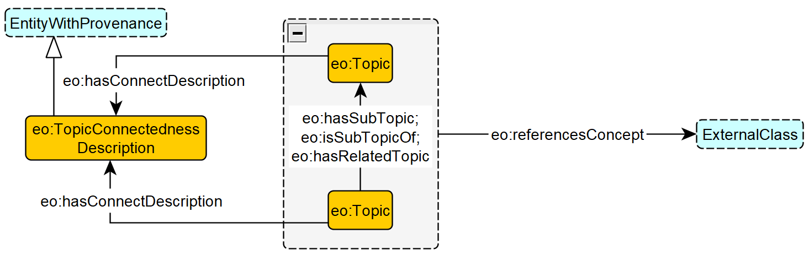
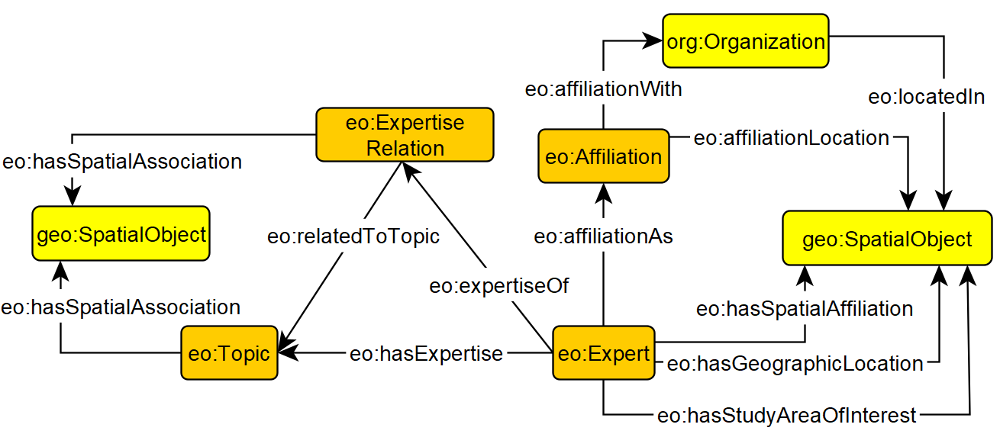

# Expertise Ontology
An ontology for modeling experts, their expertise topics and relations between them, and their spatiotemporal scoping. 

## Schema Diagrams
**Note:** _Orange boxes represent concepts central to EO. Blue boxes with dashed borders represent interfaces to, and yellow boxes areactual concepts from external patterns/ontologies that may have more semantics not covered here. Grey boxes with dashed border represent controlled vocabularies (i.e., classes that have been defined as a specific set of individuals). Black filled arrows are object or data properties, and open arrows represnet subclass relationships._

### 1. Modeling experts and their expertise on topics based

### 2. Topic and modeling topic hierarchy

### 3. Spatial scoping

### 4. Temporal scoping

## [Formalization](./expertise-ontology.ttl)

## Contributors
**Knowledge Modeling:** Shirly Stephen, Mark Schildhauer, Kitty Currier, Ling Cai, Cogan Shimizu, Pascal Hitzler, Krzysztof Janowicz

**Domain experts:** Andrew Schroeder & Anna Lopez-Carr from [Direct Relief
](https://www.directrelief.org/)
## Usage
The KnowWhereGraph Project
